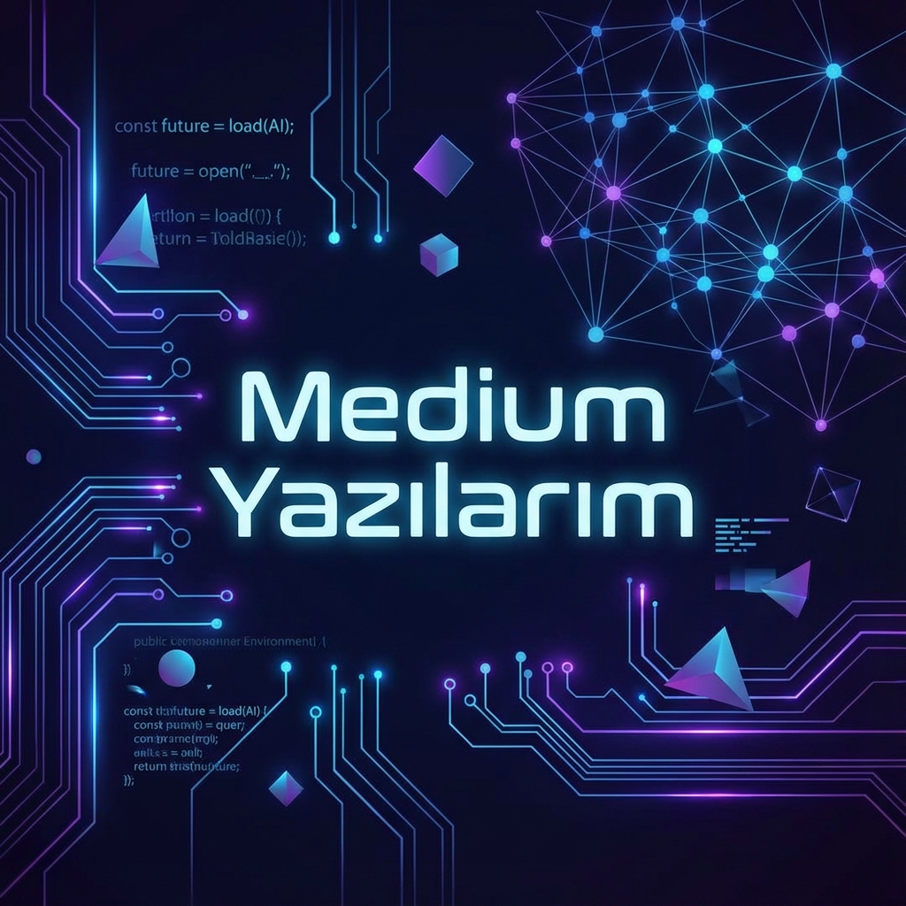

  
  
  # Medium Yazıları & İçerik Arşivi
  
  
  
  
  

  

    <strong>Teknoloji, Kariyer Gelişimi ve Geleceğin Dünyası üzerine küratörlü içerikler.</strong>
     
    <a href="#-öne-çıkanlar">Öne Çıkanlar</a> •
    <a href="#-teknoloji--yazılım">Teknoloji</a> •
    <a href="#-kariyer--gelişim">Kariyer</a> •
    <a href="#-yaşam--toplum">Yaşam</a> •
    <a href="#-katkı">Katkı</a>
  

---

## 🌟 Hakkında

Bu repo, sadece bir yazı arşivi değil; **yapay zeka**, **yazılım mühendisliği**, **kariyer inşası** ve **dijital yaşam** üzerine derinlemesine analizlerin, kod örneklerinin ve stratejik rehberlerin bulunduğu dinamik bir kütüphanedir. 

Burada bulacağınız her içerik, teorik bilgiden ziyade **sahadan deneyimler** ve uygulanabilir **stratejiler** üzerine kuruludur.

## 🔥 Öne Çıkanlar

| Kategori | Başlık | Açıklama |
|----------|--------|----------|
| 🧠 **Psikoloji** | [Hikaye Anlatıcılığı Şifadır](hikaye_anlaticiligi/hikaye-anlaticiligi-sifadir.md) | Kelimelerin nörobilimsel iyileştirici gücü üzerine bir inceleme. |
| 🚀 **Kariyer** | Meslek Devrimi | Teknoloji çağında kariyerinizi yeniden tasarlamanın yolları. |
| 🤖 **Yapay Zeka** | Yapay Zeka Çağında Yazılım | AI araçlarıyla yazılım geliştirme süreçlerini optimize etmek. |
| 💰 **Finans** | Teknoloji Çalışanları Finans Rehberi | Yazılımcılar için finansal özgürlük stratejileri. |

---

## 📂 İçerik Kütüphanesi

### 💻 Teknoloji & Yazılım
Modern yazılım dünyasının yapı taşları ve en iyi uygulamaları.

- **[Yapay Zeka Çağında Yazılım](yapay_zeka_caginda_yazilim/)**: Copilot, ChatGPT ve yeni nesil geliştirme.
- **[Meta Mühendisliği](meta_mühendisliği/)**: Sistemi bir bütün olarak gören mühendislik yaklaşımı.
- **[Web3 & Blockchain](web3_blockchain_gelistirici_rehberi/)**: Merkeziyetsiz geleceğe geliştirici bakışı.
- **[Siber Güvenlik Rehberi](siber_guvenlik_rehberi/)**: Güvenli kodlama ve sistem koruma pratikleri.
- **[Araçlar](araçlar/)**: Geliştirici verimliliğini artıran betikler ve konfigürasyonlar.

### 🚀 Kariyer & Gelişim
Profesyonel yaşamda bir adım öne geçmek isteyenler için stratejiler.

- **[Meslek Devrimi](meslek_devrimi/)**: Kariyer yolculuğunuzu bir ürün gibi yönetin.
- **[Freelance Developer Rehberi](freelance_developer_rehberi/)**: Özgürlüğe giden yolda müşteri ve proje yönetimi.
- **[Dijital Nomadlık & Coğrafi Arbitraj](dijital_nomadlik_cografi_arbitraj/)**: Dünyayı ofisiniz yapın.
- **[Açık Kaynak Katkı Rehberi](acik_kaynak_katki_rehberi/)**: Global projelere katkı vererek büyüyün.
- **[Kişisel Marka & İçerik](kisisel_marka_icerik_uretimi/)**: Görünürlüğünüzü ve etkinizi artırın.

### 🌱 Yaşam & Toplum
Teknolojinin ötesinde, insan olmaya ve topluma dair notlar.

- **[Üniversitelerin Vaziyeti](ünilerin_vaziyeti/)**: Akademik sistem üzerine eleştirel bakış.
- **[Zihinsel Sağlık & Refah](zihinsel_saglik_gelistirici_refahı/)**: Tükenmişlikten korunma ve denge.
- **[Uzaktan Çalışma Kültürü](remote_calisma_kulturu/)**: Evden çalışırken verimli ve mutlu kalmak.
- **[Spora Başlama Rehberi](spora_başlama_rehberi/)**: Aktif bir yaşam için ilk adımlar.
- **[Girişim Ekosistemi](startup_ecosystem/)**: Fikirden ürüne giden yolculuk.

---

## 🛠️ Kod Örnekleri

Yazılarımda bahsettiğim konseptleri somutlaştıran kod parçacıklarına repo içinde ulaşabilirsiniz.

*   🐍 **Python**: Veri analizi ve otomasyon.
*   ⚡ **Go**: Performanslı sistem araçları.
*   🌐 **JavaScript/TypeScript**: Modern web uygulamaları.
*   🐚 **Bash**: Sistem yönetimi ve scriptler.

## 🤝 Katkıda Bulunun

Bu repo topluluk katkılarına açıktır. Bir düzeltme öneriniz veya eklemek istediğiniz bir kaynak mı var?
Lütfen [CONTRIBUTING.md](CONTRIBUTING.md) dosyasını inceleyin ve bir **Pull Request** gönderin!

## 📜 Lisans

Bu proje [MIT Lisansı](LICENSE) altında lisanslanmıştır. İçerikler kaynak gösterilerek paylaşılabilir.

---

  
<i>Bahattin Yunus tarafından ❤️ ile hazırlanmıştır.</i>

  <a href="https://www.linkedin.com/in/bahattinyunus/">LinkedIn</a> •
  <a href="https://medium.com/@bahattinyunus">Medium</a> •
  <a href="https://github.com/bahattinyunus">GitHub</a>

