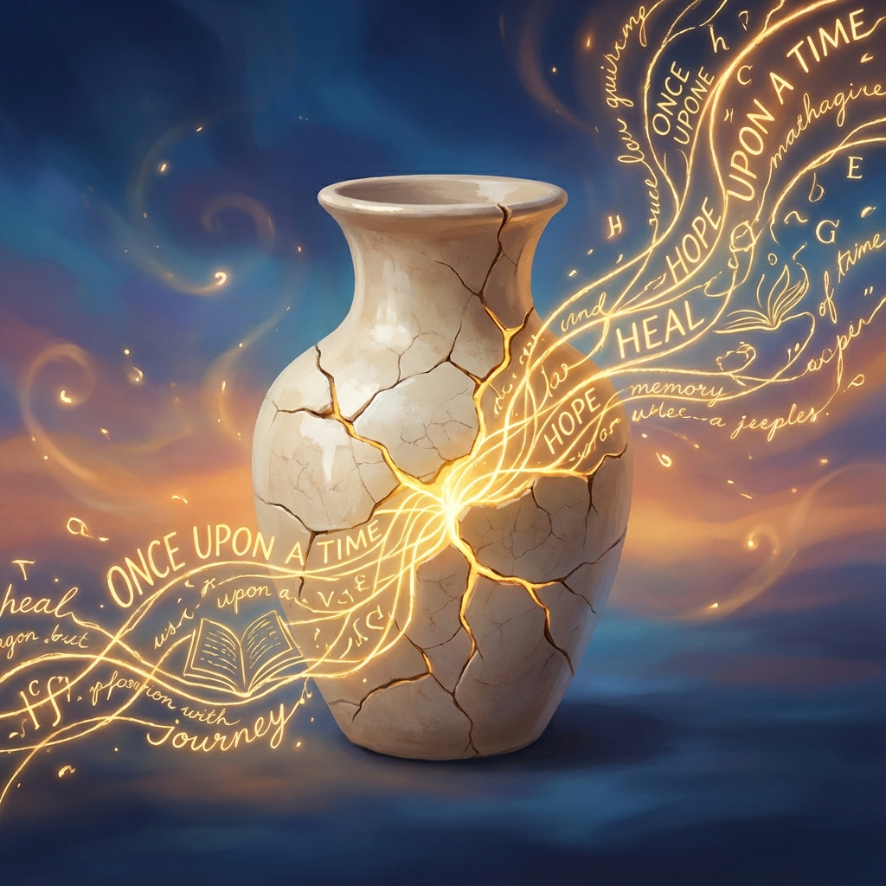

# Hikaye Anlatıcılığı Şifadır: Kelimelerle İyileşme Sanatı

**Kendi hikayemizi anlatmak beynimizi ve ruhumuzu nasıl değiştirir?**

İnsanlık tarihi boyunca ateş başında toplanıp hikayeler anlattık. Mağara duvarlarına çizdiğimiz bizonlardan, bugün dijital ekranlarda paylaştığımız 280 karakterlik kesitlere kadar, dürtü hep aynıydı: "Ben buradayım, bunu yaşadım ve bu benim hikayem."

Peki, hikaye anlatmak sadece bir iletişim aracı mı? Yoksa hayatta kalmamızı sağlayan, ruhumuzu onaran çok daha derin bir mekanizma mı? Bilim ve deneyimler, hikaye anlatıcılığının (storytelling) sadece eğlenceli değil, aynı zamanda şifalı olduğunu gösteriyor. Gelin, kelimelerin iyileştirici gücüne yakından bakalım.

## Beynimiz Hikayeleri Nasıl İşler?

Beynimiz, rastgele verilerden ve soyut bilgilerden çok, hikayelere tepki vermek üzere evrimleşmiştir. Bir sunumda istatistikleri dinlerken beynin sadece dil işleme merkezleri (Broca ve Wernicke alanları) aktif olurken, "Bir zamanlar..." diye başlayan bir hikaye dinlediğimizde beynimiz adeta bir havaifişek gösterisine dönüşür.

**Ayna Nöronlar ve Empati:** Bir hikayede karakterin yaşadığı acıyı veya sevinci dinlediğimizde, beynimizdeki ayna nöronlar devreye girer. Sanki o olayı biz yaşıyormuşuz gibi hissederiz. Bu, sadece empati kurmamızı sağlamakla kalmaz, aynı zamanda yalnız olmadığımızı, başkalarının da benzer duygular yaşadığını hissettirerek bizi rahatlatır. 

Paul Zak'ın araştırmalarına göre, etkileyici bir hikaye dinlediğimizde beynimiz **oksitosin** salgılar. "Güven hormonu" veya "sarılma hormonu" olarak da bilinen oksitosin, bizi daha cömert, güven dolu ve şefkatli kılar. Yani iyi bir hikaye, biyolojik kimyamızı değiştirme gücüne sahiptir.

## Kendini İyileştirmek (Self-Healing)

"İçine atma, anlat rahatlarsın" sözü, sadece bir halk tavsiyesi değil, bilimsel bir gerçektir. Psikolog James Pennebaker'ın öncülük ettiği **"Expressive Writing" (Dışavurumcu Yazım)** çalışmaları, travmatik deneyimlerini yazıya döken insanların bağışıklık sistemlerinin güçlendiğini, stres seviyelerinin düştüğünü ortaya koymuştur.

Hikaye anlatmak neden iyileştirir?

1.  **Anlamlandırma Çabası:** Travmatik olaylar genellikle kaotik ve anlamsızdır. Onları bir hikaye formuna sokmak (başlangıç, gelişme, sonuç), beynin bu kaosu düzenlemesine ve olaya bir anlam yüklemesine yardımcı olur.
2.  **Nesneleştirme:** Deneyimlerimizi kağıda döktüğümüzde veya anlattığımızda, onlara dışarıdan bakma şansı buluruz. Olay artık "benim içimde beni yiyip bitiren bir şey" değil, "karşımda duran ve incelenebilir bir hikaye" haline gelir. Bu mesafe, iyileşme için kritiktir.
3.  **Gücü Geri Kazanmak (Narrative Therapy):** Hayatımızın yazarı biziz. Geçmişi değiştiremeyiz ama geçmişin hikayesini nasıl anlattığımızı değiştirebiliriz. Kendinizi bir kurban olarak mı anlatıyorsunuz, yoksa zorlukların üstesinden gelen bir kahraman olarak mı? Hikayenizi yeniden kurgulamak (reframing), geleceğinizi şekillendirir.

## Bağ Kurmak ve Toplumsal Şifa

Hikayeler sadece bireyi değil, toplumları da iyileştirir. "Senin hikayen, benim hikayemdir" diyebildiğimizde, aradaki duvarlar yıkılır.

Büyük felaketler, toplumsal travmalar veya ortak acılar sonrasında insanların bir araya gelip anılarını paylaşması tesadüf değildir. Yas tutmak, kolektif bir hikaye anlatma sürecidir. Birbirimizin hikayesini dinlemek, "Ben de oradaydım, ben de hissettim" demek, görünmez yaraları sarar. Yalnızlık, modern çağın en büyük hastalıklarından biriyken, hikaye anlatıcılığı en eski ilacıdır.

## Sonuç: Sizin Hikayeniz Ne?

Kelimeler sihirli değildir, ama sihirli bir etki yaratırlar. İçinizdeki düğümleri çözmek, kırgınlıklarınızı onarmak ve dünyayla yeniden bağ kurmak için en güçlü aracınız kendi sesinizdir.

Bugün bir değişiklik yapın. Bir defter alın veya bir dosta gidin. Ve anlatmaya başlayın. Mükemmel cümleler kurmanıza gerek yok. Sadece anlatın. Çünkü hikayeniz duyulmayı, en çok da sizin tarafınızdan anlaşılmayı bekliyor.

Unutmayın: Hikayeyi anlatmak, şifayı başlatmaktır.

---
*Bu yazı, hikaye anlatıcılığının nörobilimsel ve psikolojik etkileri üzerine bir derlemedir.*
